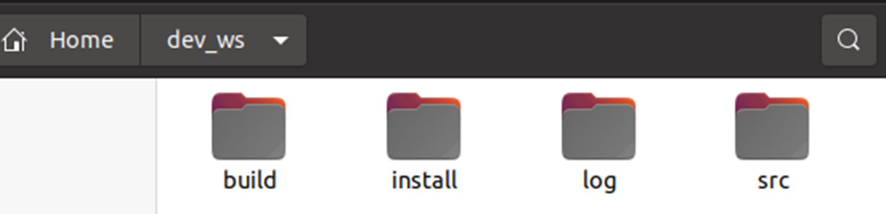

# ROS2
## 【预备知识】
### 【换源及软件下载】
使用`apt`从服务器下载安装，需要提前添加服务器地址和服务器的秘钥，这一步就叫添加源或者换源。    
```
# 1. 备份原文件
sudo cp /etc/apt/sources.list /etc/apt/sources.list.backup

# 2. 打开文件
sudo gedit /etc/apt/sources.list

# 3. 修改文件，去浏览器搜索镜像内容，替换原内容

# 4. 更新源
sudo apt update
```
软件下载方法参考：
https://www.cnblogs.com/xwdreamer/p/3623454.html    
### 【环境搭建】
```
# 设置编码
sudo apt update && sudo apt install locales
sudo locale-gen en_US en_US.UTF-8
sudo update-locale LC_ALL=en_US.UTF-8 LANG=en_US.UTF-8 
export LANG=en_US.UTF-8

# 为ROS2单独添加源
sudo apt update && sudo apt install curl gnupg lsb-release 
sudo curl -sSL https://raw.githubusercontent.com/ros/rosdistro/master/ros.key -o /usr/share/keyrings/ros-archive-keyring.gpg 
echo "deb [arch=$(dpkg --print-architecture) signed-by=/usr/share/keyrings/ros-archive-keyring.gpg] http://packages.ros.org/ros2/ubuntu $(source /etc/os-release && echo $UBUNTU_CODENAME) main" | sudo tee /etc/apt/sources.list.d/ros2.list > /dev/null

# 安装ROS2
sudo apt update
sudo apt upgrade
sudo apt install ros-humble-desktop

# 设置环境变量
source /opt/ros/humble/setup.bash
echo " source /opt/ros/humble/setup.bash" >> ~/.bashrc 
```
ROS的安装位置在`/opt/ros`    
### 【环境变量】
查看ROS版本    
`echo $ROS_VERSION`     

查看ROS发行版名称    
`echo $ROS_DISTRO`     

查看所以环境变量列表    
`printenv`    

查看指定环境变量（过滤）    
`printenv | grep XXX`

修改环境变量    
`export 环境变量名=修改后的值`

ROS2是通过环境变量`AMENT_PREFIX_PATH`来找到功能包和可执行文件的      

### 【CMakeLists模板】   
```
cmake_minimum_required(VERSION 3.10)

# 项目名称
project(ros_cpp_node)

# 编译选项
if(CMAKE_COMPILER_IS_GNUCXX OR CMAKE_CXX_COMPILER_ID MATCHES "Clang")
  add_compile_options(-Wall -Wextra -Wpedantic)
endif()

# 搜索头文件和库文件，分别保存在环境变量${rclcpp_INCLUDE_DIRS}和${rclcpp_LIBRARIES}中
find_package(ament_cmake REQUIRED)
find_package(rclcpp REQUIRED)

# 设置可执行文件名，并指定源文件
add_executable(ros_cpp_node src/cpp_node.cpp)

# 当前项目的头文件搜索路径，系统路径是默认的，无需添加
# include会默认搜索CMakeLists.txt所在的同级目录下名为include的文件夹
include_directories(
include
${rclcpp_INCLUDE_DIRS}
)

# 设置可执行文件的依赖库，即g++语法中的-lXXX 选项
target_link_libraries(ros_cpp_node
${rclcpp_LIBRARIES}
)

# 以上两句在ROS2中可简化为
ament_target_dependencies(ros_cpp_node rclcpp)

# 将可执行文件拷贝到install/中，以便ROS2能找到
install(TARGETS ros_cpp_node
  DESTINATION lib/${PROJECT_NAME}
)

if(BUILD_TESTING)
  find_package(ament_lint_auto REQUIRED)
  # the following line skips the linter which checks for copyrights
  # comment the line when a copyright and license is added to all source files
  set(ament_cmake_copyright_FOUND TRUE)
  # the following line skips cpplint (only works in a git repo)
  # comment the line when this package is in a git repo and when
  # a copyright and license is added to all source files
  set(ament_cmake_cpplint_FOUND TRUE)
  ament_lint_auto_find_test_dependencies()
endif()

# 结束标志
ament_package()

```
为了让VsCode中`rclcpp`不标红下划线以及能够实现相关函数跳转，可以点击"#include"下的**黄色**小灯泡，选择"Edit includePath setting",之后找到"include path"，添加`/opt/ros/humble/include/**`

### 【功能包的创建与编译】    
创建工作空间    
`mkdir -p 工作空间名字/src`    
工作空间的结构为（编译后自动生成）：

- src，代码空间，未来编写的代码、脚本，都需要人为的放置到这里；
- build，编译空间，保存编译过程中产生的中间文件；
- install，安装空间，放置编译得到的可执行文件和脚本；
- log，日志空间，编译和运行过程中，保存各种警告、错误、信息等日志。   

在src目录下创建功能包
```
cd dev_ws/src
ros2 pkg create example_cpp --build-type ament_cmake --dependencies rclcpp
```    
功能包的结构为：

在工作空间的目录下编译**所有**功能包    
`colcon build`   

添加环境变量    
`source install/setup.bash`    

编译特定功能包    
`colcon build --packages-select 功能包名字`

当编译多个包且包与包之间还存在**依赖关系**的时候，需要在**package.xml**中添加：    
`<depend>需要依赖的包</depend>`   

package.xml详细指令：
https://blog.csdn.net/weixin_47695827/article/details/141600818      

### 【节点】
```
#include "rclcpp/rclcpp.hpp"

class TestNode : public rclcpp::Node
{
public:
    // 构造函数,有一个参数为节点名称
    TestNode(std::string name) : Node(name)
    {
        RCLCPP_INFO(this->get_logger(), "%s节点已经启动.", name.c_str());
    }

private:
    // 声明节点
};

int main(int argc, char **argv)
{
    /*argc代表命令参数个数，argv为参数*/
    rclcpp::init(argc, argv);
    /*创建对应节点的共享指针对象*/
    auto node = std::make_shared<TestNode>("test_node");
    /* 运行节点，并检测退出信号*/
    rclcpp::spin(node);
    rclcpp::shutdown();
    return 0;
}

```   
修改CMakeLists.txt文件，添加依赖库    
```
add_executable(ros_cpp_node src/cpp_node.cpp)
ament_target_dependencies(ros_cpp_node rclcpp)
install(TARGETS ros_cpp_node
  DESTINATION lib/${PROJECT_NAME}
)
```
编译    
```
colcon build
source install/setup.bash
ros2 run example_cpp ros_cpp_node
```
编译指定的功能包   
`colcon build --packages-select 功能包名字`

### 【话题】  
- 列出话题   
`ros2 topic list`     

- 查看话题信息   
`ros2 topic info /话题名字`    

- 查看消息具体内容     
`ros2 interface show 消息类型`     

- 监听消息    
`ros2 topic echo /话题名字`     

- 发送消息     
`ros2 topic pub /话题名字 消息类型 "{数据名: {变量：}}"`     
**注意冒号后面有空格，层级关系用括号划分，消息每1s发送一次**

导入消息接口    
1. CMakeLists.txt文件中添加：     
```
find_package(std_msgs REQUIRED)
ament_target_dependencies(ros_cpp_node rclcpp std_msgs)
```
2. package.xml文件中添加：     
`<build_depend>std_msgs</build_depend>`     
**ROS2会将消息文件转换成一个类，并把其中的定义转换成类的成员函数。**     
3. 然后我们添加对应的头文件：    
`#include "std_msgs/msg/string.hpp"`    

创建话题发布者
```
class TopicPublisher01:public rclcpp::Node
{
public:
    TopicPublisher01(std::string name):Node(name)
    {
        /*创建话题发布者，其中参数10表示队列长度*/
        publisher = this->create_publisher<std_msgs::msg::String>("command",10);
        RCLCPP_INFO(this->get_logger(),"publisher created successfully!");
        /*创建一个500ms的定时器*/
        timer = this->create_wall_timer(std::chrono::milliseconds(500),std::bind(&TopicPublisher01::timer_callback,this));
    }
private:
    /*声明话题发布者指针 */
    rclcpp::Publisher<std_msgs::msg::String>::SharedPtr publisher;
    /*声明定时器指针*/
    rclcpp::TimerBase::SharedPtr timer;

    /*定义回调函数*/
    void timer_callback()
    {
        // 创建消息
        std_msgs::msg::String message;
        message.data = "forward";
        // 日志打印
        RCLCPP_INFO(this->get_logger(),"Publishing: '%s'",message.data.c_str());
        // 发布消息
        publisher->publish(message);
    }
};
```   
创建话题订阅者
```
class TopicSubscribe01:public rclcpp::Node
{
private:
    /*声明话题订阅者指针*/
    rclcpp::Subscription<std_msgs::msg::String>::SharedPtr subscribe;
    /*定义回调函数，输入参数为话题类型对应的智能指针*/
    void command_callback(const std_msgs::msg::String::SharedPtr msg)
    {
        double speed = 0.0f;
        if(msg->data == "forward")
        {
            speed = 0.2f;
        }
        RCLCPP_INFO(this->get_logger(),"current speed is %.2f",speed);
    }
public:
    TopicSubscribe01(std::string name) : Node(name)
    {
        RCLCPP_INFO(this->get_logger(),"Subscribe has created successfully!");
        /*创建话题订阅者*/
        subscribe = this->create_subscription<std_msgs::msg::String>("command",10,std::bind(&TopicSubscribe01::command_callback,this,std::placeholders::_1));
    }
};
```
### 【服务】
- 列出服务    
`ros2 service list`     

- 手动调用话题 
`ros2 service call /服务名 服务类型 "{数据名: {变量1：,变量2：}}"`     
**格式类似与话题pub，变量默认为0**

- 查看服务接口类型    
`ros2 service type /服务名`    

- 查看某个接口类型的服务有哪些   
`ros2 sercive find 服务类型`   

服务接口导入与话题接口导入一样   
创建服务端
```
class ServiceClient : public rclcpp::Node
{
private:
    /*声明服务指针*/
    rclcpp::Service<example_interfaces::srv::AddTwoInts>::SharedPtr add_server;
    /*回调函数，其中两个参数分别为请求和响应类型对应的智能指针*/
    void handle_add_two_ints(
    const std::shared_ptr<example_interfaces::srv::AddTwoInts::Request>request,
    const std::shared_ptr<example_interfaces::srv::AddTwoInts::Response>response){
    RCLCPP_INFO(this->get_logger(),"get the numble %ld and %ld",request->a,request->b);
    response->sum = request->a + request->b;
    }
public:
    ServiceClient(std::string name):Node(name)
    {
        RCLCPP_INFO(this->get_logger(),"client has created successfully!");
        /*创建指针，两个参数分别为服务名字和回调函数*/
        add_server = this->create_service<example_interfaces::srv::AddTwoInts>("add_two_ints_srv",std::bind(&ServiceClient01::handle_add_two_ints,this,std::placeholders::_1,std::placeholders::_2));
    }
};
```  
创建客户端
```
class ServiceClient01 : public rclcpp::Node
{
private:
    /*声明客户端指针*/
    rclcpp::Client<example_interfaces::srv::AddTwoInts>::SharedPtr client_;
    /*回调函数，输入参数为SharedFuture类型*/
    void result_callback(const rclcpp::Client<example_interfaces::srv::AddTwoInts>::SharedFuture result_future)
    {
        auto response = result_future.get();
        RCLCPP_INFO(this->get_logger(),"the result is %ld",response->sum);
    }

public:
    ServiceClient01(std::string name):Node(name)
    {
        RCLCPP_INFO(this->get_logger(),"server has created successfully!");
        /*创建客户端*/
        client_ = this->create_client<example_interfaces::srv::AddTwoInts>("add_two_ints_srv");
    }

    void send_requset(int a,int b)
    {
        /*1、等待客户端上线，延迟等待时间为1s*/
        while(!client_->wait_for_service(std::chrono::seconds(1)))
        {
            /*等待时检测rclcpp的状态*/
            if(!rclcpp::ok())
            {
                RCLCPP_INFO(this->get_logger(),"等待服务过程被中断...");
                return;
            }
            RCLCPP_INFO(this->get_logger(),"等待服务器上线中...");
        }

        /*2、构造请求*/
        auto request = std::make_shared<example_interfaces::srv::AddTwoInts_Request>();
        request->a = a;
        request->b = b;

        /*3、发送异步请求，然后等待返回，返回时调用回调函数*/
        client_->async_send_request(request,std::bind(&ServiceClient01::result_callback,this,std::placeholders::_1));
    }
};
```    

### 【自定义接口】   
话题接口为`xxx.msg`,例如：    
```
int64 num
```
服务接口为`xxx.srv`,例如：   
```
int64 a
int64 b
---
int64 sum
```     
动作接口为`xxx.action`,例如：   
```
int32 order
---
int32[] sequence
---
int32[] partial_sequence
```   
   
创建自定义接口，需要在`msg`、`srv`、`action`文件夹下创建对应的`.msg`、`.srv`、`.action`文件：    
```
.
├── CMakeLists.txt
├── msg
│   ├── xxx1.msg
│   └── xxx2.msg
├── package.xml
└── srv
    └── xxx3.srv
```
在`CMakeLists.txt`中添加依赖：    
```
find_package(rosidl_default_generators REQUIRED)

rosidl_generate_interfaces(${PROJECT_NAME}
  "msg/xxx1.msg"
  "msg/xxx2.msg"
  "srv/xxx3.srv"
  #如果存在混合包，即一个包中包含另一个的包的接口，则需要添加
  #DEPENDENCIES xxx
)
```   
然后在`package.xml`中添加依赖：    
```
<member_of_group>rosidl_interface_packages</member_of_group>
```   
编译后，会在`/install/功能包名/include`中看到c++头文件    
如果想要查看所有接口内容：    
```
ros2 interface list
```   
如果想要查看某个接口内容：    
```
ros2 interface show 接口类型
```   
### 【参数】   
- 列出参数   
`ros2 param list`     

- 查看参数描述     
`ros2 param describe /节点名 参数名`   

- 获取参数值     
`ros2 param get /节点名 参数名`

- 设置参数    
`ros2 param set /节点名 参数名 参数值`     

- 存储参数    
`ros2 param dump /节点名 > 参数文件名.yaml`    

- 加载参数    
`ros2 param load /节点名 参数文件名.yaml`     